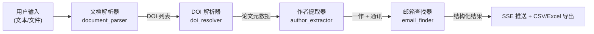
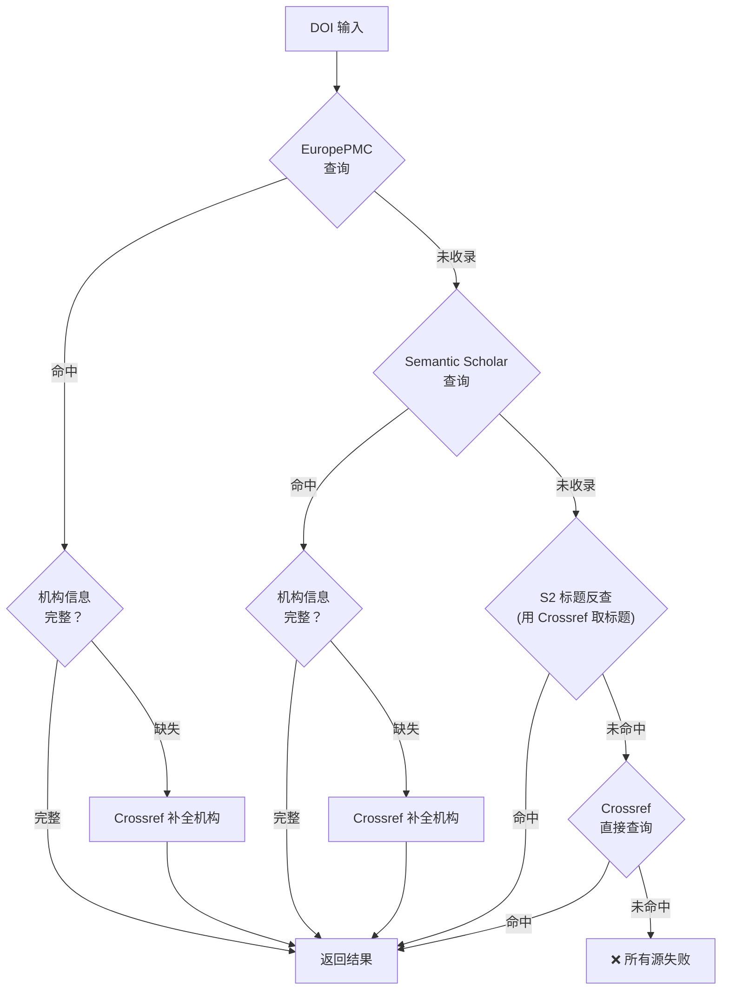
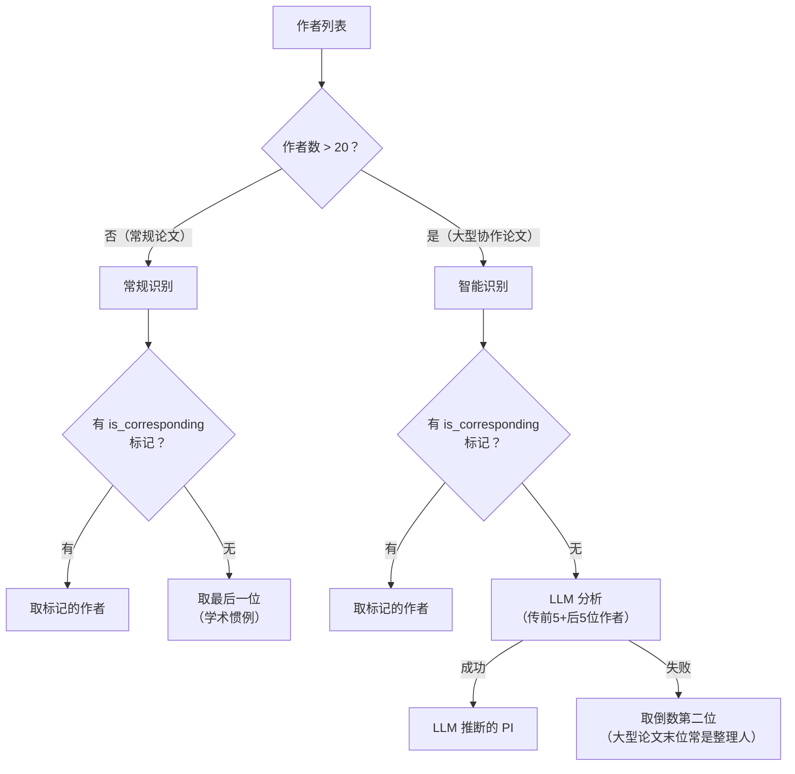
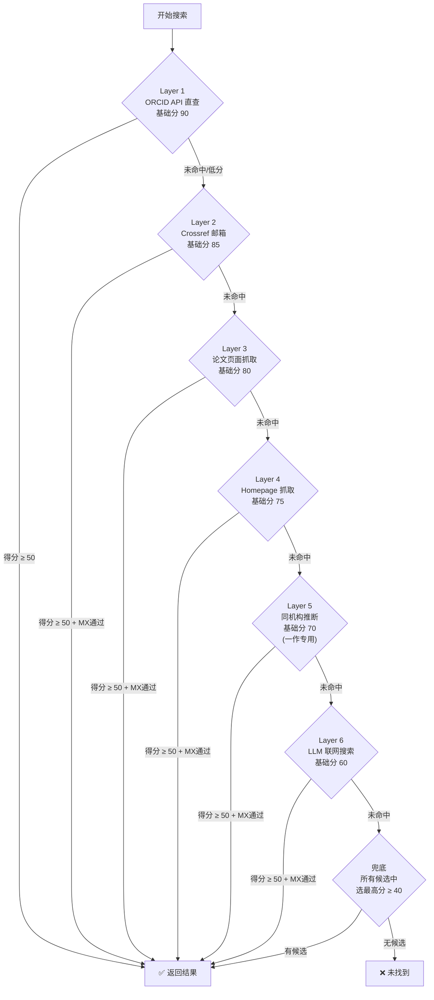
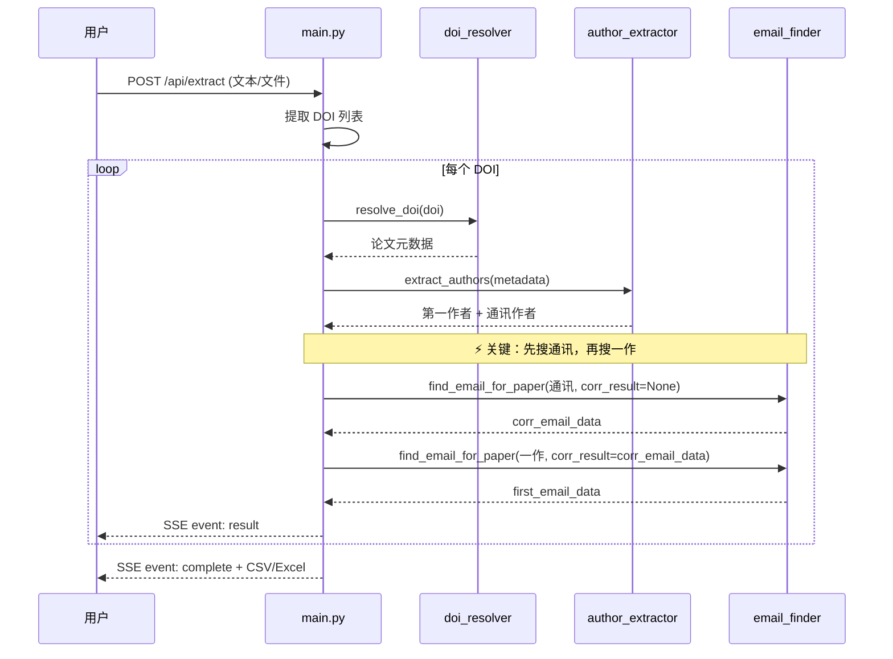
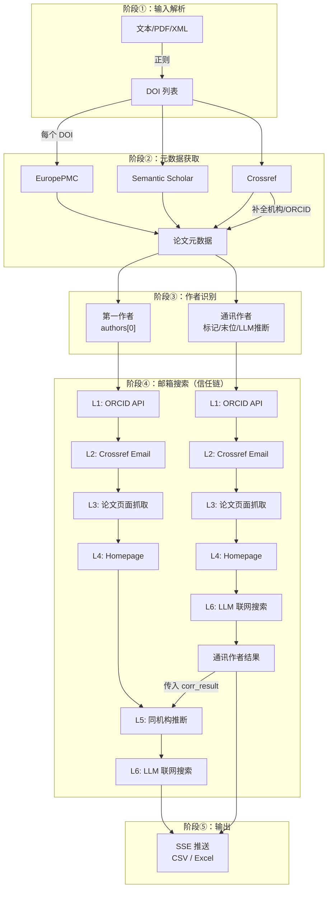

# 伯乐 Scholar Agent —— 搜索逻辑详细梳理

> 版本：V4.0 信任链架构 | 后端：通义千问 Qwen-Plus | 梳理日期：2026-04-07

---

## 一、系统总览：端到端流水线



整个系统是一条 **5 阶段串行流水线**，每篇论文独立走完全部阶段：

| 阶段 | 模块 | 输入 | 输出 |
|------|------|------|------|
| ① 文档预处理 | `document_parser.py` | 文本 / PDF / XML / CSV | DOI 列表 |
| ② 元数据解析 | `doi_resolver.py` | DOI | 标题、期刊、作者列表（含机构/ORCID/邮箱） |
| ③ 作者识别 | `author_extractor.py` | 作者列表 | 第一作者 + 通讯作者 |
| ④ 邮箱搜索 | `email_finder.py` | 作者信息 | 邮箱 + 来源 + 置信分 |
| ⑤ 结果汇总 | `main.py` | 逐条结果 | SSE 实时推送 + 文件导出 |

---

## 二、阶段 ①：文档预处理 — `document_parser.py`

### 核心职责
从用户的多格式输入中提取所有合法 DOI 编号。

### DOI 正则
```python
DOI_PATTERN = r'\b(10\.\d{4,9}/[a-zA-Z0-9./_()\\-:;]+)'
```
覆盖绝大多数出版商的 DOI 格式，自动清理尾部标点（包括中文标点 `，。；）】》`）。

### 支持的输入格式

| 格式 | 解析方式 |
|------|----------|
| 纯文本 / 粘贴 | 直接正则匹配 |
| PDF 文件 | PyMuPDF (`pymupdf`) 逐页提取文本 → 正则 |
| XML / HTML | 原始文本读取 → 正则（不依赖 XML 解析器，兼容畸形文件） |
| CSV / TXT / BIB | 按纯文本读取 → 正则 |

### 去重策略
- 大小写不敏感去重（`doi.lower()`）
- 文本输入 + 文件输入合并后全局去重

---

## 三、阶段 ②：DOI 元数据解析 — `doi_resolver.py`

### 核心职责
将 DOI 转换为结构化的论文元数据（标题、期刊、作者列表含机构/ORCID/邮箱）。

### 三通道瀑布策略



#### 通道 0：EuropePMC（最优先 — 生物医学领域最强源）

- **API 端点**：`https://www.ebi.ac.uk/europepmc/webservices/rest/search?query=DOI:{doi}&format=json&resultType=core`
- **独特优势**：
  - 结构化 `authorList` 含 `firstName` / `lastName` 清晰拆分
  - **`authorEmail` 字段**：直接提供通讯作者邮箱（其他 API 没有！）
  - 从 `authorAffiliationDetailsList` 中可提取嵌入的邮箱（如 `"...Electronic address: xxx@yyy.org."`)
  - 作者 ORCID（`authorId.type == "ORCID"`）
- **邮箱分配逻辑**：
  1. 优先：从该作者的 `affiliation` 字段中正则提取到的邮箱
  2. 次之：`authorEmail` 字段按名字前缀匹配分配给对应作者
  3. 兜底：未分配的 `authorEmail` 默认给末位作者（学术惯例）

#### 通道 1：Semantic Scholar

- **API 端点**：`https://api.semanticscholar.org/graph/v1/paper/DOI:{doi}?fields=title,venue,authors,...`
- **优势**：结构化最好，提供 `homepage`、`externalIds.ORCID`
- **劣势**：`affiliations` 经常为空；不提供邮箱
- **降级策略**：若 S2 返回 404，使用 Crossref 获取标题 → 再用标题在 S2 搜索接口反查

#### 通道 2：Crossref（兜底）

- **API 端点**：`https://api.crossref.org/works/{doi}`
- **特色数据**：
  - `author.email` 字段（部分出版商提供）
  - `author.ORCID` 字段
  - `author.affiliation.name` 中可能嵌入邮箱（正则提取）
  - `author.sequence` 字段标记 `"first"` / `"additional"`
- **通讯作者推断**：若无显式标记 `is_corresponding`，默认最后一位 = 通讯

#### 跨源补全机制：`_enrich_affiliations_from_crossref()`

当 EuropePMC 或 S2 返回的作者机构信息缺失时，自动调用 Crossref 按作者姓名匹配（family name 模糊匹配）补全：
- 补全 `affiliations`
- 补全 `ORCID`
- 补全 `email`

---

## 四、阶段 ③：作者识别 — `author_extractor.py`

### 核心职责
从元数据的作者列表中精准定位**第一作者**和**通讯作者**。

### 第一作者
始终确定：作者列表的第一个 `authors[0]`。

### 通讯作者识别 — 分支策略



#### 大型协作论文的 LLM 识别
- 传入论文标题 + 期刊 + 前5位作者 + 后5位作者（避免 token 爆炸）
- Prompt 要求 LLM 从后5位中选出最可能的资深学者/PI
- 兜底：取 `authors[-2]`（大型论文最后一个常是项目整理人而非 PI）

### 输出数据结构
每位作者输出包含：`姓名`、`机构`、`主页`、`orcid`、`crossref_email`

---

## 五、阶段 ④：邮箱搜索 — `email_finder.py`（核心）

### 总体架构：7 层信任链管道

这是整个系统的**核心模块**，采用分层瀑布式搜索，每层有独立的基础信任分。

> [!IMPORTANT]
> **搜索顺序至关重要**：系统先搜通讯作者，再搜一作。这样一作搜索时可以利用通讯作者的结果（`corr_result`）进行同机构推断。



### Layer 1：ORCID API 直查（基础分 90）

- **前置条件**：DOI 解析阶段获取到了作者的 ORCID ID
- **数据源**：[orcid_resolver.py](file:///d:/Scholar_Agent/backend/services/orcid_resolver.py)
  - `/v3.0/{orcid}/person` 端点 → 公开邮箱、个人页面链接
  - `/v3.0/{orcid}/employments` 端点 → 机构历史
- **行为**：
  - 若 ORCID 返回公开邮箱 → 评分 → 若 ≥ 50 直接返回
  - 收集 ORCID 返回的 `urls` 加入 `extra_urls`（供 Layer 4 使用）
  - 若 ORCID 返回了机构信息但原始 org 为空 → 补全机构

### Layer 2：Crossref 邮箱字段（基础分 85）

- **前置条件**：DOI 解析阶段从 Crossref 提取到了 `crossref_email`
- **行为**：
  - 先做 **MX 记录验证**（确认邮箱域名存在）
  - MX 通过 → 评分 → 若 ≥ 50 直接返回
  - MX 失败 → 降级为候选（分数 30），不直接返回

### Layer 3：论文页面抓取（基础分 80）

- **执行细节**（[_scrape_paper_page()](file:///d:/Scholar_Agent/backend/services/email_finder.py#L319-L384)）：
  1. 构造抓取 URL 列表：
     - 主 URL：`https://doi.org/{doi}`（跟随重定向到出版商页面）
     - Elsevier 特殊处理：通过 Crossref 的 `link` 字段获取 ScienceDirect URL
  2. 使用 `cloudscraper` 绕过 Cloudflare 反爬
  3. **Elsevier 跳板页处理**：
     - 检测 `linkinghub.elsevier.com` → 从 `<meta http-equiv="refresh">` 提取真实 URL
     - 或从 `<a href>` 中找 ScienceDirect 链接
     - 或从 HTML 中提取 PII 号拼接 URL
  4. HTML 邮箱提取三策略（[_extract_email_from_html()](file:///d:/Scholar_Agent/backend/services/email_finder.py#L442-L488)）：
     - **策略 A：mailto 链接** → 找 `<a href="mailto:xxx">` → 名字匹配优先，否则选机构域名邮箱
     - **策略 B：通讯作者上下文** → 正则匹配 `corresponding/correspondence/email` 附近的邮箱 → 必须通过名字强匹配
     - **策略 C：全文正则** → 提取页面中所有邮箱 → 名字最佳匹配

### Layer 4：Homepage 抓取（基础分 75）

- **URL 来源拼合**：
  - Semantic Scholar 返回的 `homepage`
  - ORCID Layer 1 收集的 `extra_urls`
  - 最多抓取 3 个 URL
- **抓取方式**：与 Layer 3 相同的 `cloudscraper` + `_extract_email_from_html()`

### Layer 5：同机构推断（基础分 70，一作专用）

- **触发条件**：`role == "一作"` 且有 `corr_result`（通讯作者已找到结果）
- **策略 A：Lab 页面搜索**（[_search_lab_page_for_member()](file:///d:/Scholar_Agent/backend/services/email_finder.py#L541-L585)）
  1. 抓取通讯作者的主页/来源 URL
  2. 在该页面中搜索一作名字对应的邮箱
  3. 若未找到 → 从页面中提取 `members/people/team/lab/group/student/personnel/staff/成员/团队` 等子链接
  4. 抓取最多 3 个子页面继续搜索
- **策略 B：机构域名网站搜索**
  - 从通讯作者邮箱中提取域名（去掉 `mail.` / `email.` 前缀）
  - 访问 `https://www.{base_domain}` 搜索一作邮箱

### Layer 6：LLM 联网搜索（基础分 60）

- **核心函数**：[_llm_navigate_and_scrape()](file:///d:/Scholar_Agent/backend/services/email_finder.py#L591-L648)
- **底层调用**：`smart_generate_with_search()`（通义千问 `enable_search=True` 联网模式）
- **Prompt 策略**：
  - 自然语言 prompt，告诉 LLM 作者姓名、机构、DOI、已知机构域名
  - 要求 LLM 搜索：其他论文通讯信息、大学官方页面、Google Scholar 档案、个人主页
  - **不要求 JSON 输出**，而是从 LLM 自然语言回复中用正则提取邮箱
- **邮箱选择优先级**：
  1. 与目标名字强匹配的邮箱
  2. 机构域名（`.edu` / `.ac.` / `.org` / `.gov`）的邮箱
  3. 回复中的第一个邮箱

### 兜底策略

若 6 层均未直接命中：
- 从所有层积累的候选邮箱中重新评分
- 选最高分的候选，若 ≥ 40 分则作为结果返回
- 全部 < 40 分 → 返回 "未找到"

---

## 六、评分验证机制（Layer 7）

所有层找到的邮箱都必须经过统一的 [_score_email()](file:///d:/Scholar_Agent/backend/services/email_finder.py#L654-L695) 评分：

### 评分规则

| 评分项 | 分值 | 说明 |
|--------|------|------|
| 基础分 | 90/85/80/75/70/60 | 由来源层级决定 |
| 域名匹配机构 | **+10** | 邮箱域名与已知机构名有词汇交叉 |
| 名字匹配邮箱前缀 | **+10** | 邮箱前缀包含作者名字部分 |
| 多源交叉印证 | **+15** | 同一邮箱出现在不同层级的候选中 |
| MX 记录验证通过 | **+5** | DNS MX 记录确认域名可接收邮件 |
| MX 记录验证失败 | **-20** | 域名无法接收邮件 |
| 名字完全无关 | **-30** | 邮箱前缀与名字完全无交集（Layer 3+ 才扣分，ORCID/Crossref 不扣） |

### 置信度等级

| 分值 | 等级 |
|------|------|
| ≥ 70 | 高 |
| 50-69 | 中 |
| < 50 | 低 |

### 域名-机构匹配算法 `_domain_matches_org()`

1. 将域名按 `.` 拆分 → 检查每段是否出现在机构名中（≥3 字符）
2. 将机构名按空格/逗号拆分 → 检查每个词是否出现在域名中（≥4 字符）
3. 查询机构域名缓存（跨论文复用）

### 名字-邮箱匹配算法 `_is_strong_name_match()`

处理的复杂场景：

| 输入场景 | 预期行为 |
|----------|----------|
| `"T. Kanneganti"` vs `thirumala-devi.kanneganti@...` | ✅ 匹配（家族姓匹配 + 首字母出现） |
| `"Wei Wang"` vs `weiwang@...` 或 `w.wang@...` | ✅ 匹配（initials+family 组合） |
| `"J.-P. Bhatt"` vs `jp.bhatt@...` | ✅ 匹配（缩写拼接 + 家族姓） |
| `"Li"` vs `oliver@...` | ❌ 不匹配（单名防误匹配） |

算法步骤：
1. 清理邮箱前缀（去 `._-`）和名字（去 `.` `-`）
2. 区分首字母缩写 vs 完整名字部分
3. **核心条件**：家族姓（通常最后一个完整词）必须出现在邮箱前缀中
4. 给定名检查：缩写只需首字母出现；完整词需子串匹配
5. 兜底：`initials + family` 或 `family + initials` 拼接匹配

---

## 七、辅助机制

### 机构域名缓存（跨论文复用）

```python
_org_domain_cache = {}  # 全局字典，同批次生效
```

- 每次成功找到邮箱后，缓存 `机构名 → 邮箱域名` 的映射
- 仅缓存学术域名（`.edu` / `.ac.` / `.org` / `.gov` / `.cn`）
- 查询时支持部分匹配（`org_key in cached_key` 或反向）
- 被 Layer 6 LLM 搜索使用（传入 `domain_hint` 提升搜索精度）

### MX 记录验证

```python
@lru_cache(maxsize=256)
def _verify_email_mx(email: str) -> bool
```

- 通过 `dns.resolver` 查询域名的 MX 记录
- 结果缓存（LRU 256 容量），避免重复 DNS 查询
- 超时 5 秒
- 异常时默认返回 `True`（宁可误过不可错杀）

### 噪音邮箱过滤

预定义 25 个噪音关键词，过滤以下类型邮箱：
- 系统邮箱：`noreply`, `admin`, `support`, `webmaster`
- 编辑部邮箱：`editor`, `editorial`, `journal`, `submission`
- 占位邮箱：`xxx@`, `your`, `name@`, `placeholder`, `test@`

### LLM 后端配置

| 项目 | 值 |
|------|-----|
| 供应商 | 阿里云通义千问 |
| 主力模型 | `qwen-plus` |
| 备用模型 | `qwen-turbo` |
| 协议 | OpenAI 兼容 |
| 联网搜索 | `enable_search=True`（千问专属） |
| 温度 | 0.1（追求确定性） |

---

## 八、主流程调度 — `main.py`

### 处理顺序的关键设计



> [!TIP]
> **先通讯后一作**是刻意设计：通讯作者的邮箱/主页信息会作为 `corr_result` 传入一作搜索，供 Layer 5 同机构推断使用。这使得一作的搜索成功率显著提升。

### SSE 事件类型

| 事件 | 用途 |
|------|------|
| `progress` | 实时进度更新（步骤名 + 状态 + 详情） |
| `result` | 单条 DOI 的完整结果 |
| `error` | 错误信息 |
| `complete` | 全部处理完成 + 导出文件链接 |

---

## 九、数据流转全景图


