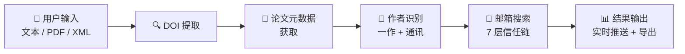
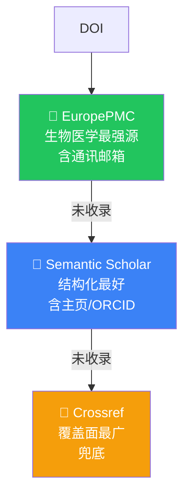
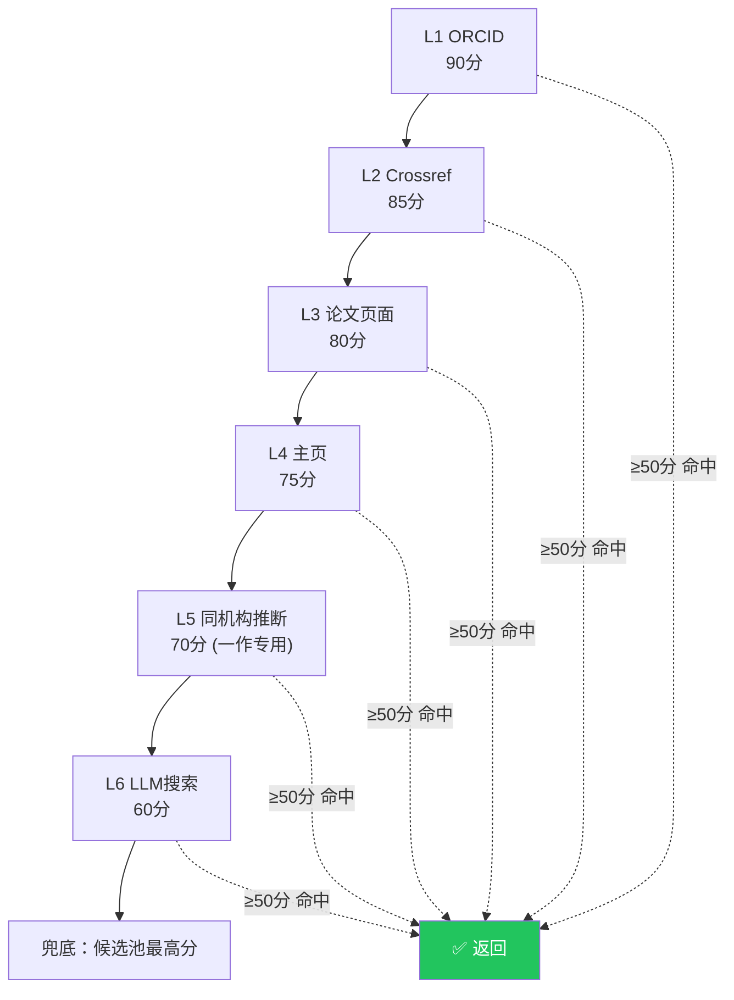

# 伯乐 Scholar Agent — 搜索逻辑概览（PPT 版）

---

## 🎯 系统定位

**一句话**：输入 DOI → 自动找到第一作者和通讯作者的邮箱

---

## 📐 系统架构（5 阶段流水线）



---

## 📡 元数据获取：三通道瀑布策略



> 任一通道命中后，自动用 Crossref 补全缺失的机构/ORCID 信息

---

## 🔗 核心：7 层信任链邮箱搜索

| 层级 | 数据源 | 基础分 | 关键特点 |
|:----:|--------|:------:|----------|
| **L1** | ORCID API 直查 | **90** | 最高可信源，公开邮箱直取 |
| **L2** | Crossref 邮箱字段 | **85** | 出版商元数据中直接提供 |
| **L3** | 论文页面抓取 | **80** | cloudscraper 绕反爬 + HTML 解析 |
| **L4** | 个人主页抓取 | **75** | S2/ORCID 提供的 homepage |
| **L5** | 同机构推断 | **70** | 🌟 一作专用：利用通讯作者的 lab 页 |
| **L6** | LLM 联网搜索 | **60** | 通义千问联网模式搜索 |
| **L7** | 评分验证 | — | 所有结果必须过分数线 |



> **设计哲学**：越靠上的层越可信，命中即停，避免低质量源污染结果

---

## ✅ 评分验证机制

```
最终得分 = 基础分(60~90) + 加分项 - 扣分项
```

| 评分项 | 分值 |
|--------|------|
| 域名匹配机构 | +10 |
| 名字匹配邮箱 | +10 |
| 多源交叉印证 | +15 |
| MX 验证通过 | +5 |
| MX 验证失败 | -20 |
| 名字完全无关 | -30 |

| 置信度 | 分数范围 |
|--------|----------|
| 🟢 高 | ≥ 70 |
| 🟡 中 | 50-69 |
| 🔴 低 | < 50 |

---

## 🌟 设计亮点

````carousel
### 💡 先通讯后一作
先搜通讯作者 → 结果传入一作搜索
一作可利用通讯的 Lab 页和机构域名推断自己的邮箱
<!-- slide -->
### 💡 LLM 只当导航器
LLM 不直接返回邮箱（会编造）
而是联网搜索 → 从回复中正则提取 → 再做独立验证
<!-- slide -->
### 💡 跨论文机构缓存
找到邮箱后缓存 `机构→域名` 映射
同批次后续论文的搜索自动加速
<!-- slide -->
### 💡 MX 记录验证
不仅看邮箱格式合法
还验证域名是否真实存在 MX 接收记录
````

---

## 📁 核心模块一览

| 模块 | 职责 | 代码量 |
|------|------|--------|
| `document_parser.py` | 多格式 DOI 提取 | ~114 行 |
| `doi_resolver.py` | 三通道元数据获取 | ~405 行 |
| `author_extractor.py` | 一作/通讯识别 | ~143 行 |
| `orcid_resolver.py` | ORCID 公开 API 查询 | ~164 行 |
| `email_finder.py` | **7 层信任链搜索** | ~903 行 |
| `main.py` | FastAPI 流水线调度 | ~247 行 |
